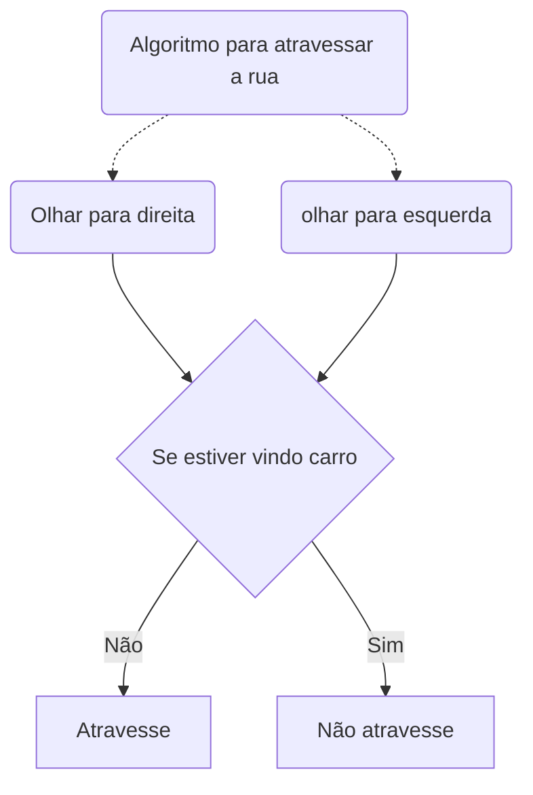
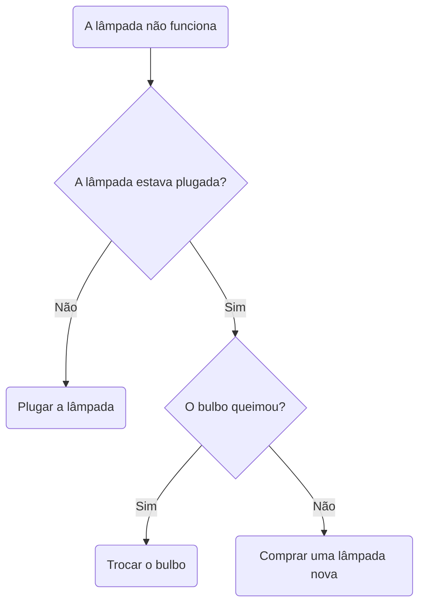
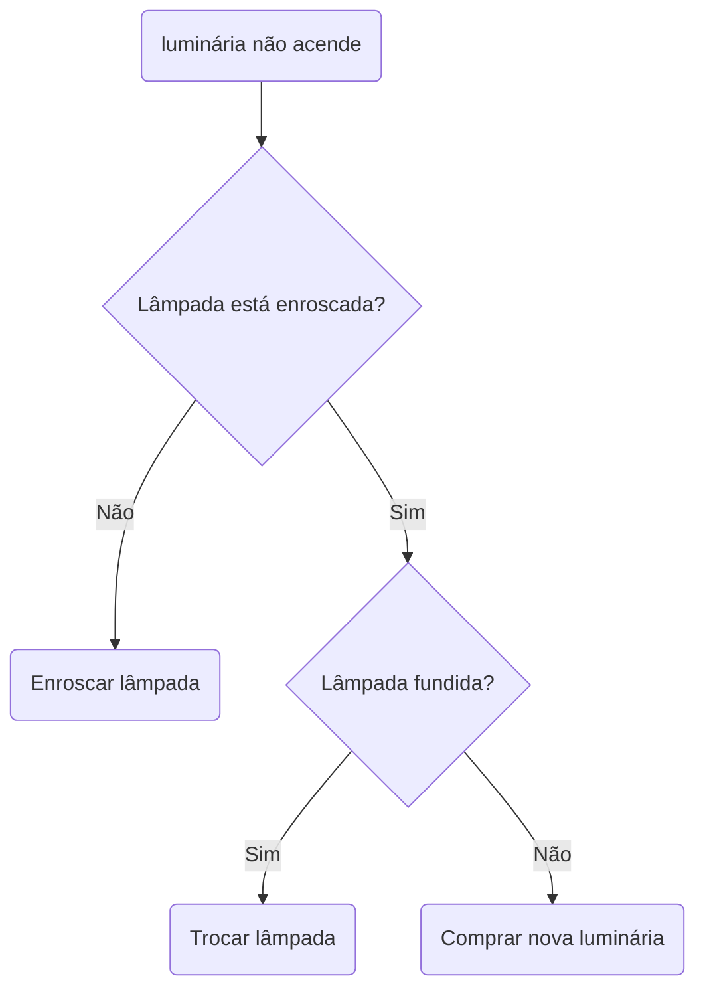
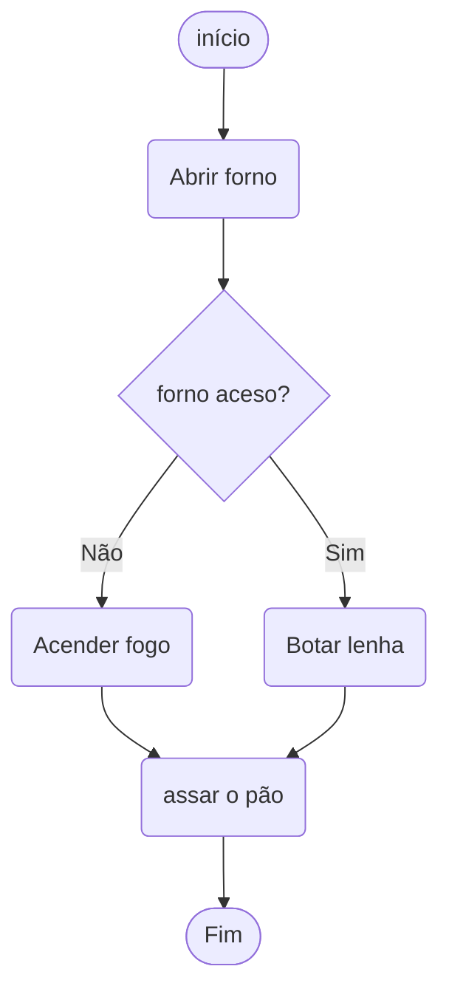

  
# ----------- OQUE SÃO ALGORITMOS? :thinking: -----------

  
> - ***Algoritmos são conjuntos de passos finitos e organizados que, quando executados, resolvem um determinado problema.***
> - ***Toda reprodução de padrão é conhecida como rotina, esse tema também é usado em algoritmos.***

  

 

# ----------- ALGORITMOS SERVEM PARA O QUÊ? :raised_eyebrow: -----------

  
> - Algoritmos servem para resolver problemas e executar tarefas de forma organizada e estruturada. 
> - Eles são conjuntos de passos finitos e bem definidos que, quando seguidos corretamente, permitem alcançar um objetivo específico

  
Veja Alguns exemplos de aplicativos e tecnologias que fazem parte do nosso dia a dia atualmente e usam algoritmos ↷

  |  | |
  | --- | ---|
  |  **Redes Sociais** | _Os algoritmos são utilizados pelas redes sociais para decidir quais postagens, anúncios e recomendações de amigos ou páginas são mostrados no feed de notícias de cada usuário._ |
  |  **Assistentes Virtuais** | _Algoritmos de processamento de linguagem natural são usados em assistentes virtuais como Siri, Google Assistant e Alexa para entender e responder às nossas perguntas e comandos._ |
  |  **GPS e Navegação** | _Os aplicativos de navegação utilizam algoritmos para calcular a rota mais rápida e eficiente para chegar ao nosso destino, levando em consideração o tráfego e outras condições._ |
  |  **Filtros de E-mails** | _Os algoritmos são empregados para identificar e filtrar e-mails indesejados (spam) em nossa caixa de entrada._ |
  | **Recomendações Compras Online** | _Plataformas de comércio eletrônico utilizam algoritmos para sugerir produtos com base em nossas compras anteriores e interesses._ |
  

 ↻ Clique em "▶" Para abrir os exemplos ou fechar

  
# ----------- EXEMPLOS :nerd_face: -----------
***Rotida do nosso cotidiano, Algoritmo hipotetico:***

---

