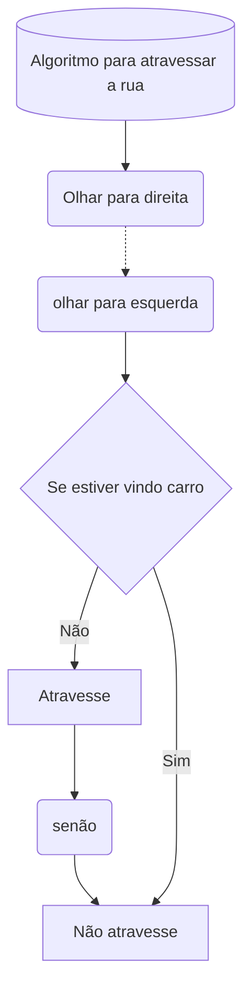

  
# ----------- OQUE SÃO ALGORITMOS? -----------

  
> - ***Algoritmos são conjunto de passos finitos e organizados que, quando executados, resolvem um determinado problema.***
> - ***Toda reprodução de padrão é conhecido como rotina, esse tema tambem é usado em algoritmos***

  

 

---
# ----------- EXEMPLOS -----------
Rotida do nosso cotidiano, Algoritmo hipotetico:

